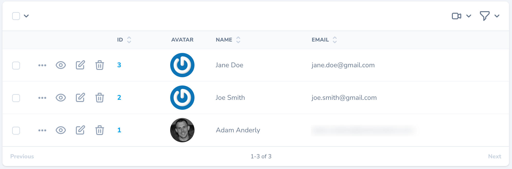

# Nova Actions Left

Moves the resource actions column to the left on the ResourceTableRow.

## Installation

You can install the package via composer:

For Laravel Nova 4+:

`composer require saintsystems/nova-actions-left`

For Laravel Nova 3.x and below, see [flagstudio/nova-actions-left](https://github.com/flagstudio/nova-actions-left)..

The package will automatically register itself.

## Credits

- [Adam Anderly](https://github.com/anderly)
- [Saint Systems](https://github.com/saintsystems)
- [All Contributors](../../contributors)
- Originally forked from [flagstudio/nova-actions-left](https://github.com/flagstudio/nova-actions-left).

## License

The MIT License (MIT). Please see [License File](LICENSE.md) for more information.
